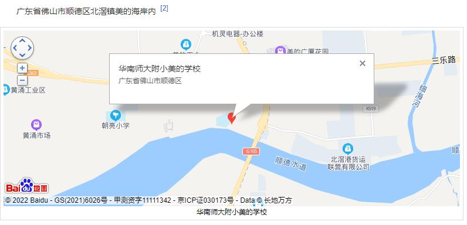
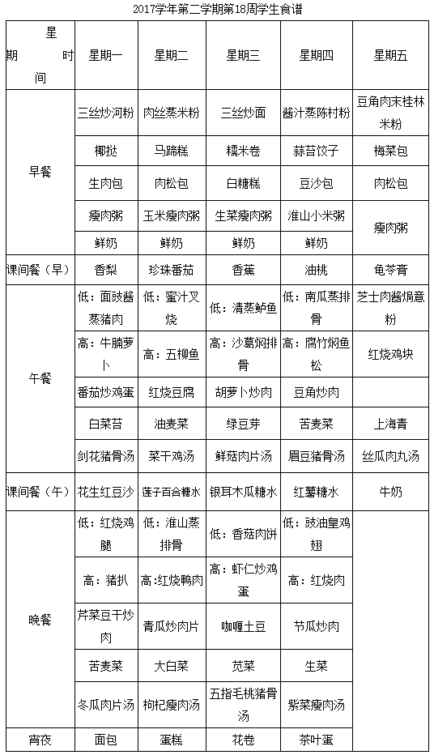
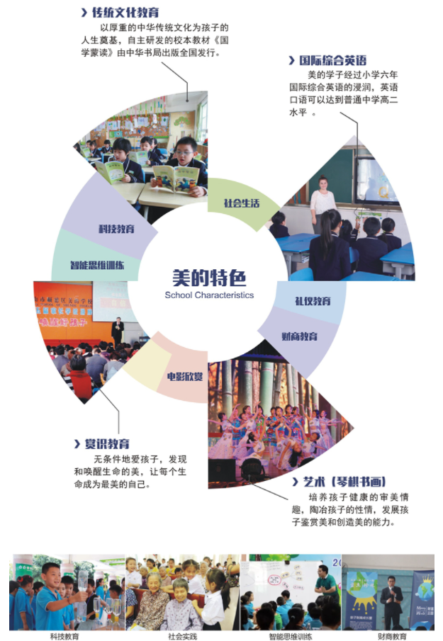
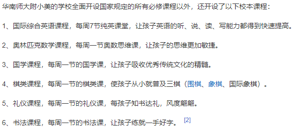
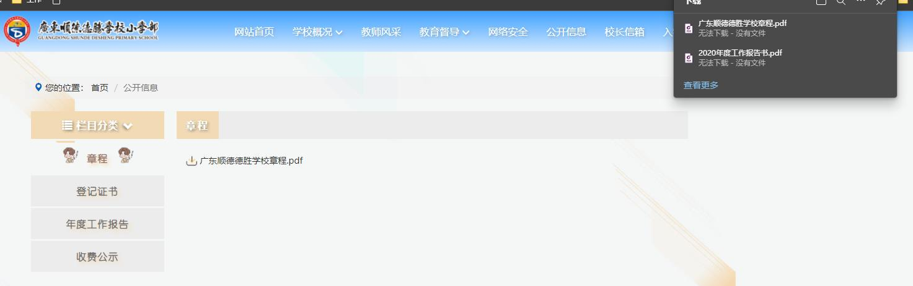
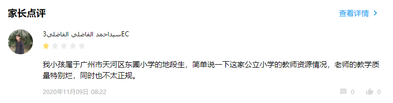

学校对比与讨论
===

广州佛山几所学校

---
[TOC]
---
## 对比分析
无

# Appendix

## 顺德美的小学
[官网](http://www.mdxx.sdedu.net/)
“美的学校”是美的集团和华师附小联合创办的走读与寄宿相结合的精品名校。2000年6月由佛山市顺德区教育局审批成立，由北滘镇教育组管辖。学校于2000年9月3日式开办，面向珠三角招收适龄儿童，实施小学六年义务教育 。
### 学校位置
[学校总览](https://720yun.com/t/2dn7dm2pp3ha8yyq0x?pano_id=sdhNo8cibWWJEmtD)
顺德北滘华南师大附小美的学校位于广东省绿色小区顺德区北滘镇美的海岸内，坐落在北江之畔，校园环境优美。学校占地62亩 ，建筑面积13000平万米，绿化率达60 % 。

### 招生情况
小学一年级招收6个班，每班38人，共228人。要求心智正常，身体健康，2022.08.31之前满六周岁。[2022级招生公告](http://www.mdxx.sdedu.net/?f=lists&catid=91)

### 费用

初中：仅学杂费4万左右。[小升初网](https://www.xsc.cn/news/202104/34707.html)

小学：24800元/年。
住宿费：半寄宿 250元/人/月，全寄宿 4000元/年。[小升初网(2019年数据)](https://www.xsc.cn/news/201805/7386.html)

### 生活面貌
[餐饮状况](http://www.mdxx.sdedu.net/?f=lists&catid=87)

[丰富活动](http://www.mdxx.sdedu.net/?f=lists&catid=88)
除此之外，还有体检、晨练、生活小能手竞赛晚会、下棋、跑步等，较为丰富。但是缺少17年后数据。

### 特色课程
无法确定这些课程是否定期开放,百度百科讲述每周定期开放。

### 师资力量
全校专职教师36名，其中特级教师1名，小学高级教师20人,大学本科学历25人,大专学历11人，学历100%大专化，拥有6名国家级奥数教练，省、市、区优秀教师、优秀班主任、骨干教师15人。[顺德城市网 2017.08](http://www.shundecity.com/a/sdjy/xuexiaominglu/bei_/xiaoxue/2017/0816/201931.html)

### 升学情况
学校被评为广东省首届“十佳民办学校”，佛山市“优质学校”，佛山市“绿色学校”等荣誉。截至2010年底，已经毕业的毕业生中，大部分同学都考入**华师附中分校、广东省育才中学、广东省天河实验中学、佛山市华英中学，顺德一中等省一级学校**，2008年，刘风泽同学(MIT)夺得了佛山市顺德区联考状元。[顺德城市网（2017）](http://www.shundecity.com/a/sdjy/xuexiaominglu/bei_/xiaoxue/2017/0816/201931.html)

### 联系方式
联系电话（招生办）： 0757-26332371
梁老师（小学）：15521021084
李老师（中小学）：13703076616
联系邮箱： mideaschool@163.com

## 德胜小学
[官网](http://www.jxxs.net/)
广东顺德德胜学校小学部，原名“佛山市顺德德胜小学”（前身：顺德区嘉信西山小学），是广东德胜教育集团兴办的民办小学，于2002年9月开办，2018年9月起，分成低年部和高年部两个校区办学，2020年2月并入广东顺德德胜学校成为十二年一贯制学校。办学十九年来，全校师生共同努力，齐心打造了顺德民办教育的新品牌。

获得17，000多个城镇级或以上荣誉。

但是官网差评,好多信息搜索不到，有的显示存在但还是空的。

### 学校位置
顺德大良新城区呈祥路
### 招生情况
**2014年8月31日（含8月31日）前出生**，身体健康，且未接受过义务教育的适龄儿童，并符合以下条件之一：

（一）户籍生：

报名开始时，学童本人户籍在顺德区的适龄儿童。

（二）非户籍常住人口随迁子女（具备以下条件之一）：

（1）报名开始时，学童父母或法定监护人一方为顺德区户籍。

（2）报名开始时，学童父母或法定监护人一方持顺德区有效期内居住证（含港澳台居民居住证）。

（3）报名开始时，学童父母一方为单位驻地在顺德区的现役军人和在职国家综合性消防救援人员。

（4）报名开始时，学童父母一方为在顺德区居住的华侨和外籍人员。

注：人民法院限制消费人员的子女不得报读民办学校，一经查实，即取消入学资格。

2020学年计划招收一年级20个班共900名新生。其中，经上级部门审核，符合单列直招条件的有272人（名单已在大良教育局官网公示），公开招生628人，招收的是英语班（使用牛津英语教材）。[招生公告](http://www.jxxs.net/jxxs/homepage/html/detail.html?type=gonggao&id=11612)

关于普通班和英语班的定义：

*普通班*：“除国家规定课程外,増设语文“主题阅读"课程和“让大脑更聪明一一基础认知能力训练课程"。

*英语班*：“:在“*普通班* ”课程基础上,加强英语教学,选用香港“牛津英语”教材,由中方教师和外籍教师合作教学,让学生将来无论继续在国內接受教育,还是出国继续学业,都拥有扎实的中国文化知识基础和出众的英语综合能力。

### 费用
学杂费：13025元/学期。
住宿费：全寄宿2175元/学期，半寄宿1350元/学期。[2018年数据](http://www.jxxs.net/jxxs/homepage/html/detail.html?type=gonggao&id=11388)
2020年广东顺德德胜学校收费标准（学费）：18392元/学期；住宿费1960元/学期；其他据实收取。（初中）[源](read://https_www.xsc.cn/?url=https%3A%2F%2Fwww.xsc.cn%2Fnews%2F201805%2F7380.html)

2019年广东顺德德胜学校收费标准（学费）[源](read://https_www.xsc.cn/?url=https%3A%2F%2Fwww.xsc.cn%2Fnews%2F201805%2F7380.html)：
初中39060元/年；初中全寄宿3920元/年。全寄宿：3920元。
小学27009元/年；半寄宿270元/月；全寄宿4350元/年。

### 生活面貌
有各种竞赛：数学、英语
### 特色课程
●德育 ：为了培养学生的良好习惯和高尚的情们坚持开展好习惯，好生活和荣誉日等活动。

●汉语教学：引入"学科阅读实验研究"，打造了全面提高汉语教学质量、培养学生人文素质的阅读功能。

●数学教学：为培养学生的智力而引入"小学生基本认知能力训练课程"。

●英语教学：根据语言习得规律，引进牛津英语教材，培养学生的综合能力。

●书法教育：为了提高手写水平，学生每天在上课时间练习10分钟。书法教育对学生具有精神意义。

●专项项目：我校承担国家级和省级项目，取得了很大成绩。我们的主要项目之一"实验教室的发展与应用"获得了"国家二等奖"。

●海外活动：加强与其他学校的沟通与合作，吸收优秀的教学经验，每年与国内外学校开展交流活动，使学校更加现代化，信息化和国际化。

### 师资力量
355名教师中，博士学历1人，研究生学历25人，中学高级教师（含副高职称）9人，具有相当专业能力的外籍教师6名。此外，学校还聘请了**191位生活老师**，全天候、全方位照顾学生的起居饮食，并在实践中不断提高服务质量，尽力做到学生安心，家长放心。
### 升学情况
[网友评论](https://www.zhihu.com/question/296370561)
可以直升德胜中学。[源](http://www.desheng-school.cn/index.php/chuzhongzhaosheng/)
初中部中考13年勇夺区中考状元，每学年都有10人左右进入区中考总分前十名，近一半的学生考入**顺德一中高中部**，近八成学生考入区属重点高中。高中部首届高考重点率高达60.6%，连续三届本科以上上线率超过95%，总上线率100%。2016年高考，陈俊杰同学摘取佛山市理科榜眼，被清华大学录取。
### 联系方式
 卢老师：0757-22808989
 黄老师：0757-22326101
 联系邮箱：2780559907@qq.com

## 宝玉直小学
**省一级**
广州市海珠区宝玉直小学位于人杰地灵的海珠之西。学校创办于1921年，是广东省一级学校、广东省优秀现代教育技术实验学校、广东省绿色学校、广州市“教育e时代”应用实验学校、 广州市社会、科学课程实验学校、广州市游泳传统项目网点学校、广州市青少年科技教育特色项目学校。[源](https://www.tianyancha.com/company/3097077815)

### 学校位置
广州市海珠区同福中路宝玉直街5号
### 招生情况
宝玉直小学位于广东省广州市海珠区海幢街道宝玉直街5号，是一所公办学校，设有小学部，创办于1921年，先后被评为“省一级”学校；属于走读制度学校，饮食方面学校无饭堂；招生条件需要符合不限户籍、本区房产、积分达标、社保达标；划分范围包括海幢街:①宝玉直社区;②宝贤社区;③宏宇社区;④仁厚直社区;⑤世昌社区的部分。[源](https://www.sxkid.com/article/vi4on.html)
[便捷了解](http://gz.bendibao.com/life/2020611/268197.shtml)
微信搜索公众号广州本地宝，关注后在对话框回复【小学】可获2021广州小学报名入口+报名操作流程+招生地段、各区小学入学政策等。
### 费用
一套房
### 生活面貌
无
### 特色课程
- 逐步形成以**无线电**、**小小科学实验家**及**生物与环境科学实践活动**为主的科技特色。开展管乐、田径等特色活动项目。

- 构建现代化节能减排的环保生态型校园。以体验教育为切入点，以“小课题”的环境教育为载体，根据小学生的特点，积极开展内容丰富、形式多样的环境科普教育活动，引导师生养成良好的环保道德意识和行为习惯，使师生从自身做起,从小事做起，养成环保节约习惯，造就具有可持续发展意识的现代人。
### 师资力量
无
### 升学情况
对口初中：南武中学、江南中学、三十三中、二十六中、四十九中、七十六中
### 联系方式
联系电话：021-84446340 84477280 020-84446340 [源](http://jz.tcmap.com.cn/campus/0/guangzhoushihaizhuqubaoyuzhijiexiaoxue.html)

## 中海康城小学
**区重点**

中海康城小学占地面积10000多平方米，校舍布局合理，环境优雅，花红草绿，散发出勃勃生机。学校建有标准200米环形塑胶跑道，塑胶篮球场；36间宽敞明亮的课室和功能室，是一所适宜学生成长、学习和身心发展的学校。
[评价](https://www.jianshu.com/p/f273d3ec4445)
[评价](https://www.sxkid.com/school/detail/schoolEvaluate/igbg3)
### 学校位置
广州市天河区中海康城香雪兰2街2号
### 招生情况
东圃大观南路（中海康城小区：紫罗兰街1—3号和5—10号，丁香街1—3栋和5—10栋，凤信街1—3号和5—9号；石竹街1—3号和5—8号，铃兰街1—3号和5—8号，蔷薇街1—3号和5—10号，薰衣草街1—3号和5—21号，蝴蝶兰街1、3、5、7、9、11、13、15、17、19、21、23、25、27号，银柳街1、3
、5、7、9号；郁金香街2、4、6号，棕榈街2、4、6号，梧桐街1、3、5、7
、9、11号，嘉兰街2、4、6、8、10、12、14、16、18、20号）；大观中路9号（东圃小新塘横岗驻军95111部队宿舍）；东圃黄村路（天雅居：黄村路
120号（A1栋）、122号（A2栋）、124号（A3栋）、126号（A4栋）、128
（B4栋）、130号(B3栋)、132号（B2栋）、134号（B1栋）、136号（C1栋）
、138号（C2栋）、140号（C3栋）、142号（C4栋）、144号（D1栋））；广州市奥体南路399号（广州边防指挥学校宿舍）、广州市奥体路818号（黄村体育基地宿舍）；园丁路1号（园丁苑）。[源](https://www.sxkid.com/school/detail/recruitInfo/igbg3)
### 费用
0.0
### 生活面貌
走读制度学校，饮食方面学校无饭堂
### 特色课程
突显英语和艺术特色
### 师资力量
学校现有3个教学班，学生80人，教师11人，均为本科学历。
### 升学情况
**小升初派位安排**
广州市华颖外国语学校 - 初中部
广东省广州市天河区员村一横路7号大院83号

**小升初对口直升安排**
广州奥林匹克中学 - 初中部
广东省广州市天河区健明六路与天坤二路交叉口
### 联系方式
招生电话：020-32231113

## 东圃小学
**市重点**
东圃小学于1936年由民国革命时期著名的爱国将领潘文治将军创办。学校位于原广州东部郊区，是一所典型的城乡结合部的学校。学校占地面积8465平方米，建筑面积6750平方米，现有24个教学班，1000多名学生，配套的教学设施设备齐全。
[评价](https://www.sxkid.com/school/detail/gbnf6)

### 学校位置
广州市天河区东圃镇车陂江头北正大街二十号
### 招生情况
东岸社区；西湖社区；东圃社区：汇友苑；天力居社区：天力居、富华楼；天雅社区；（天河广场、南国苹果园、名圃花园、怡东楼除外）。
### 费用
0.0
### 生活面貌
无
### 特色课程
象棋特色就是该校的一大亮点，在广州市很有名气，多位学生获得国家级、省级、市级和区级的奖项。[源](https://baike.baidu.com/item/%E5%B9%BF%E5%B7%9E%E5%B8%82%E5%A4%A9%E6%B2%B3%E5%8C%BA%E4%B8%9C%E5%9C%83%E5%B0%8F%E5%AD%A6/53065399)
### 师资力量
教师47人，其中小学高级教师27人，大学本科学历32人，大专毕业学历15人
### 升学情况
[注册查询](https://www.sxkid.com/school/detail/recruitInfo/gbnf6)
### 联系方式
招生电话：020-82308717