FABRIK 汇总
===
v1.0
05.31.2022
王翔

---
[TOC]

---
#1 背景与问题
机器人
##1.1 背景
&#160; &#160; &#160; &#160;根据连接方式，机器人可以分为串联机器人和并联机器人以及混联机器人。其中并联机器人有多个支链（一个支链指一个串联机器人）和一个动平台以及一个静平台组成，支链两端分别与动平台和静平台连接，混联机器人指的是串联结构和并联结构同时存在的机器人；而根据关节的刚度大小，机器人可以分为刚性关节机器人和柔性关节机器人。
&#160; &#160; &#160; &#160;机器人的运动学是机器人学理论的核心组成部分之一。然而，不同的需求对机器人的结构有着不同的影响，现有的运动学分析过程几乎全部都是针对特定的机器人进行分析，虽然也有部分进展是是针对一类机器人，比如柔性关节机器人，铰链关节机器人、万向节机器人等。但是缺少一种可以将所有上述机器人运动学全部包含在内的统一性算法。
##1.2 机器人运动学的问题
&#160; &#160; &#160; &#160;在串联机器人的运动学中，较为复杂的是逆运动学问题，正运动学问题相对简单。正运动学等价为刚性结构的平移和旋转，而其的逆运动学问题可以当做2支链的并联机器人的正运动学问题。而在并联机器人运动学中，正逆运动学都比较复杂、更为复杂的是正运动学，<font color=red><u>逆运动学较为简单</u></font>。因此将串联机器人的逆运动学合并为并联机器人的正运动学问题，以便于进一步的处理和分析。因此将基于并联机器人的运动学进行分析。
&#160;&#160;&#160;&#160;FABRIK算法是一种比较快速的启发式刚性机器人逆运动学求解算法，在之前的工作中将其应用到了柔性关节机器人的逆运动学和并联柔性机器人的正运动学求解过程中。但是其依旧受限于关节种类，导致无法快速应用到其他机器人中。为了实现预期目标，会有以下几个问题。
###1.2.1 运动单元的建立
&#160; &#160; &#160; &#160;为了将不同关节导致的不同的运动形式统一化表示，提出了运动单元这一概念。它可以以简单的几个参数，统一的表述所有关节以及相连的连杆，并且可以通过运动单元的组合，构造任意的运动链。
###1.2.2 <font color=red><u>可到达性</u></font>
&#160; &#160; &#160; &#160;并联机器人的动平台的位姿由所有支链的驱动量决定，但是多个支链的驱动量不一定能获得一个动平台位姿。因为所有支链驱动后的末端不一定满足动平台的结构约束。
&#160; &#160; &#160; &#160;由于各个连杆的长度和关节弯曲角度的约束等问题，导致机器人的工作空间外轮廓内部可能会出现一些位置可达但是特定姿态不可达的情况、甚至会出现一些位置都不可达的情况。
###1.2.3 收敛性分析
&#160; &#160; &#160; &#160;FABRIK为什么会收敛。
###1.2.4 不收敛问题
&#160; &#160; &#160; &#160;在极端情况下，会出现特殊的不收敛情况，各个关节从第一次迭代的结果和多次迭代结果完全一致。
###1.2.5 <font color=red><u>收敛缓慢问题</u></font>
&#160; &#160; &#160; &#160;在计算过程中，前几步可以将误差减小至几个毫米，但是后面几十步几百步去减小剩余的误差，更有甚者几十万步。
###*1.2.6 <font color=red><u>多解问题</u></font>
&#160; &#160; &#160; &#160;有可能的话，分析多解问题。
###*1.2.7 <font color=red><u>基于线性曲率的力学分析</u></font>
&#160; &#160; &#160; &#160;有可能的话，分析力学问题。

##1.3小结
&#160; &#160; &#160; &#160;拟解决以上几个问题
#2 运动单元
&#160; &#160; &#160; &#160;为了将不同关节导致的不同的运动形式统一化表示，提出了运动单元的概念$\mathbf{U}(l_1, l_2, \theta, \delta)$，如下图所示。
<center>
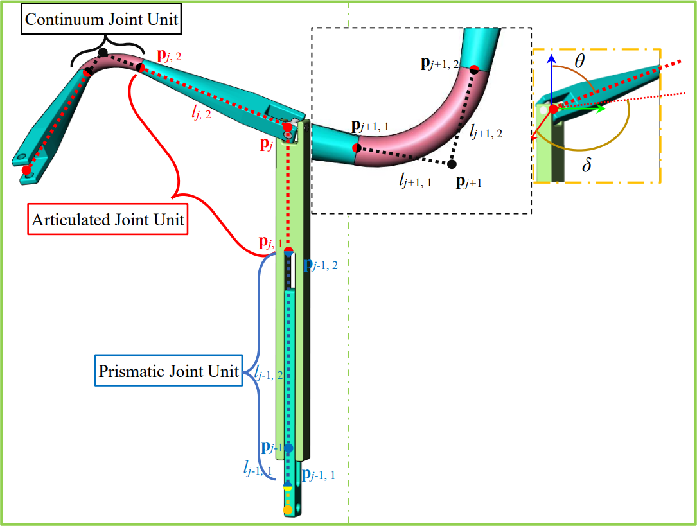

**图 1 运动单元介绍**</center>
##2.1 坐标系和变量命名
&#160; &#160; &#160; &#160;一个运动单元由一个运动单元中心和两段连接杆组成，不同的关节代表着不同的运动单元。运动单元最多只能有一个关节。其中，每个运动单元由四个参数组成$\mathbf{U}(l_1, l_2, \theta, \delta)$相邻的两个运动单元。如图1所示，在运动单元上建立坐标系以及变量命名。
+ $\{U_i\}\equiv\{\hat{\mathbf{x}}_i, \hat{\mathbf{y}}_i, \hat{\mathbf{z}}_i\}$; 原点固定在第$i$运动单元的运动中心上,其中$\hat{\mathbf{z}}_i$与第$i$运动单元的第一连杆平行，指向第二连杆。
<!-- 让表格居中显示的风格 -->
<style>
.center 
{
  width: auto;
  display: table;
  margin-left: auto;
  margin-right: auto;
}
</style>

<p align="center"><b>表1 变量命名</b></font></p>
<div class="center">

|变量名称|变量意义|
|:---:|:----------|
|$i$|运动单元的编号|
|$\mathbf{p}_i$|第$i$运动单元运动中心的位置|
|$\mathbf{p}_{i,1}, \mathbf{p}_{i,2}$|分别是第$i$运动单元的第一连杆和第二连杆末端的位置|
|$\mathbf{U}_i(l_1, l_2, \theta, \delta)$|第$i$个运动单元。其中，$l_1, l_2, \theta, \delta$分别为第一连杆和第二连杆的长度、$\mathbf{t}_{i,2}$与$\hat{\mathbf{z}}_i$的夹角以及$\mathbf{t}_{i,2}$在$\{U_i\}$的$XY$平面的投影与$\hat{\mathbf{x}}_i$的夹角|
</div>

##2.2 关节连杆与运动单元的转换
&#160; &#160; &#160; &#160;运动单元在使用时，可以通过**运动单元约束**和**三个坐标**(运动单元起始坐标、运动单元中心坐标以及运动单元末端坐标)计算$\mathbf{U}(l_1, l_2, \theta, \delta)$。前者的第二连杆与后者的第一连杆共线。
$$\mathbf{p}_{j,1}=\mathbf{p}_{j-1,2}\\
\mathbf{p}_{j,2}=\mathbf{p}_{j+1,1}$$
+ 当关节为万向节时，此时$l_1 = const_1, l_2 = const_2$为常量保持不变,$\theta，\delta$为变量，这种运动单元被称作铰接运动单元（Universal joint Motion Unit，简称为<b>UMU</b>）；
+ 当关节为球铰时，此时$l_1 = const_1, l_2 = const_2$为常量保持不变,$\theta，\delta$为变量，这种运动单元被称作铰接运动单元（Spherical joint Motion Unit，简称为<b>SMU</b>）；
+ 当关节为移动副时，此时$\theta = const_1,\delta = const_2$为常量保持不变, $l_1,l_2$变量，这种运动单元被称作平移运动单元（Prismatic joint Motion Unit，简称为<b>PMU</b>）；
+ 当关节为连续体关节时，$l_1,l_2,\theta,\delta$均为变量，这种运动单元被称作柔性运动单元（Continuum joint Motion Unit，简称为<b>CMU</b>）。
+ 当关节为旋转关节(pitch and yaw)时，此时$l_1 = const_1，l_2 = const_2，\delta = const_3$为常量保持不变, 仅$\theta$为变量，这种运动单元被称作铰接运动单元（Revolute joint Motion Unit，简称为<b>RMU</b>）；
+ 当关节为旋转关节(roll)时，此时$l_1 = const_1,l_2 = const_2,\theta = const_3$，仅$\delta$为变量，这种运动单元被称作枢轴运动单元（Pivot joint Motion Unit，简称为<b>PiMU</b>）；
+ 需要注意的是，当存在一些情况需要一些连杆之间的刚性连接（比如，两个柔性运动单元之间的刚性段、不共线相邻关节之间的刚性连接以及作为驱动量已知的运动单元）时，此时$l_1 = const_1,l_2 = const_2,\theta = const_3,\delta = const_4$，这种运动单元被称作固定运动单元（Fixed joint Motion Unit，简称为<b>FMU</b>）；
+ 其他的运动单元可以根据运动形式对$\mathbf{U}(l_1, l_2, \theta, \delta)$进行分配组合与定义。

##2.3 并联机器人的逆运动学算法
&#160; &#160; &#160; &#160;针对2支链的并联柔性机器人的正运动学求解，拟采用计算较为快速的FABRIK算法。
&#160; &#160; &#160; &#160;然而由于原始的FABRIK算法是通过将当前的万向节旋转中心指向上一个连杆的末尾，将下一个连杆指向下一个万向节旋转中心，<font color=red><u>如图所示 缺图</u></font>。这样将会导致一系列问题，一是无法兼容更多的关节，二是只能约束位置这三个自由度。后来一些针对柔性关节的FABRIK算法被提出，这些算法只考虑了柔性关节的特性，忽视了刚性关节，缺乏模块化特性。因此，采用基于运动单元的FABRIK算法，可以兼容柔性关节在内的所有关节特性使其具有可模块化堆叠的特性，同时可以约束5个自由度。
<font color=red><u>缺图</u></font>
**算法1伪码**
```
Input:	pj, lj, 1, lj, 2, qnew, j = 1, 2, 3, …, n.
	//其中，lj, 1, lj, 2,是结构参数；qnew是新的驱动量，即两端关节为主动关节。pj是//各个运动单元中心的位置。
Output:	pj, j = 1, 2, 3, …, n.
	//pj是新的驱动量下的各个运动单元中心的位置。，默认所有的驱动量都有至少//一个结果满足所有约束。
1.1	(p'1, p'1, 2, p'n, p'n, 1) = calcFirstJoint(qnew);
	//根据驱动量计算首末关节位姿
1.2	b1 = p'1, bs1 = p'1, 2, bn = p'n, bsn = p'n, 1;
1.3	errp = || bn – pn ||.
1.4	while (errp > tol)
1.5	    //前向运动
1.6	    pn=bn,pn, 1=bsn;
1.7	    for i = n – 1, …, 3, 2
1.8	        e1 = (pi + 1, 1 – pi + 1)/||pi + 1 – pi + 1, 1||;
1.9	        pi = pi + 1, 1 + li, 2e1;
1.10	        e2 = (pi – 1 – pi)/|| pi – 1 – pi ||;
1.11	        if FMU
	            // l1, l2, θ, δ均为常量
1.12	            pi, 1 = pi + li, 1e1;
1.13	        else if PMU
            //针对移动副，li, 1是变量，li, 2是常量；
1.11	            li, 1=|| pi – 1 – pi ||(e2Te1) – li – 1, 2;
1.12	            pi, 1 = pi + li, 1e1;
1.14	        else if SMU
            //针对转动，li, 1、li, 2是常量；
1.15	            pi, 1 = pi + li, 1e2;
1.16	        else if CMU
	            //针对连续体运动单元，li, 1、li, 2是变量；
1.17	            L =θli, 1/tan(θ/2);
1.18	            θ = acos(e2Te1);
1.19	            li, 1 = li, 2 = Ltan(θ/2)/θ;
1.20	            pi = pi + 1, 1 + li, 2e1;
1.21	            e2 = (pi – 1 – pi)/|| pi – 1 – pi ||;
1.22	            pi, 1 = pi + li, 1e2;
1.23	        end
1.24	    end
	    
1.25	    p1 = b1 , p1, 2 = bs1,
    //反向运动
1.26	    for i =2, 3, …, n – 1
1.27	        e1 = (pi – 1 – pi – 1, 2)/||pi – 1 – pi – 1, 2||;
1.28	        pi = pi – 1, 2 + li, 1e1;
1.29	        e2 = (pi + 1 – pi)/|| pi + 1 – pi ||;
1.30	        if FMU
	            // l1, l2, θ, δ均为常量
1.31	            pi, 2 = pi + li, 2e1;
1.32	        else if PMU
            //针对移动副，li, 1是变量，li, 2是常量；
1.33	            li, 1 =|| pi + 1 – pi – 1, 2 ||(e2Te1) – li, 2 – li + 1, 1;
1.34	            pi = pi – 1, 2 + li, 1e1;
1.35	            pi, 2 = pi + li, 2e1;
1.36	        else if SMU
            //针对转动，li, 1、li, 2是常量；
1.37	            pi, 2 = pi + li, 2e2;
1.38	        else if CMU
	            //针对连续体运动单元，li, 1、li, 2是变量；
1.39	            L =θli, 1/tan(θ/2);
1.40	            θ = acos(e2Te1);
1.41	            li, 1 = li, 2 = Ltan(θ/2)/θ;
1.42	            pi = pi – 1, 1 + li, 1e1;
1.43	            e2 = (pi + 1 – pi)/|| pi + 1 – pi ||;
1.44	            pi, 2 = pi + li, 2e2;
1.45	        end
1.46	    end
1.47	    errp = || bn – pn ||;
1.48	end
```


&#160; &#160; &#160; &#160;<font color=red><u>将多支链分为两组，在前向时，第一组支链的公共节点由各个支链末端位姿的均值决定，建立动平台。在后向时，第二组支链的公共节点由各个支链末端位姿的均值决定，建立动平台。</u></font>

##2.4 算法测试
1)	2-SPCC (iteration = 3)
    <center>
    

    **图 2 2-SPCC运动链的正运动学**

2)	2-SPCS (iteration = 2)
    <center>
    
    
    **图 3 2-SPCS运动链的正运动学**
    
    

3)	3-PCC (iteration = 151)
    <center>
    
    

    **图 4 3-PCC运动链的正运动学(1-33次迭代)**
    

4)	2-SPCS (iteration = 53)
    <center>
    
    

    **图 5 3-CSS运动链的正运动学(1-33次迭代)**

5)	3-PCS (iteration = 44)
    <center>
        
    

    **图 6 3-PCS运动链的正运动学(1-33次迭代)**
</center>


#3 可到达性分析
&#160; &#160; &#160; &#160;暂时不会

思路1，到达空间多边形顶点的距离小于相应支链长度的点，如果不存在这个点，则认为无解，反之不一定。


#4 收敛性分析
&#160; &#160; &#160; &#160;基于关节的FABRIK算法是通过连续不断的前向运动和后向运动完成收敛，前向运动与后向运动在一些文献（A.）中详细介绍。前向运动与后向运动再结构上是对称的。此外，前向/后向运动中，每一关节的处理方法是相同的。

&#160; &#160; &#160; &#160;同样的，如图所示，基于运动单元的FABRIK算法中的运动单元处理方法是相同的。在前向运动过程中，当三个（至少3个，前一个是处理后的运动单元或者是固定不动的运动单元$\mathbf{U}_{i+1}$；中间一个是待处理运动单元，后一个是未处理运动单元或者是固定不动的运动单元$\mathbf{U}_{i-1}$）运动单元存在时，中间运动单元位型的变化。将运动单元$\mathbf{U}_i$的第二连杆与运动单元$\mathbf{U}_{i+1}$的第一连杆保持共线且相连，然后将运动单元$\mathbf{U}_i$的第一连杆指向$\mathbf{U}_{i-1}$的运动中心，这个过程称为一次**调整**。

&#160; &#160; &#160; &#160;以2支链并联结构为例，设运动链有N个运动单元，其中第1个运动单元和第N个运动单元为驱动型运动单元，其他一共有N-2个被动型运动单元。

&#160; &#160; &#160; &#160;根据算法的构造原理，可以发现前向和后向步骤在过程中均是通过多次的**调整**实现的。因此，在前向运动的步骤中，以第 $i$ 运动单元的运动为例，第 $i$ 运动单元的第二连杆移动到第 $i+1$ 运动单元的第一连杆末端，并且两连杆共线，第 $i$ 运动单元的第一连杆指向第 $i$ 单元的运动中心；直到指向第一运动单元。而在后向运动的步骤中，同样以第 $i$ 运动单元的运动为例，第 $i$ 运动单元的第一连杆移动到第 $i-1$ 运动单元的第二连杆末端，并且两连杆共线，第$i$运动单元的第二连杆指向第$i+1$单元的运动中心；直到指向最后一个运动单元。尽管它们相似，但算法的每一次**调整**有不同的目标。同时，在第$m-1$次迭代时，设与目标位姿之间的距离称为$s_{m-1}$。在第$m$次迭代后， $s_m < s_{m-1}$；因此，当两个步骤都完成时，末端执行器已经移动到更靠近目标的位置，并且经过多次迭代，末端执行器到达目标。

然而，为什么会收敛将在以下部分内容中介绍。

<center>

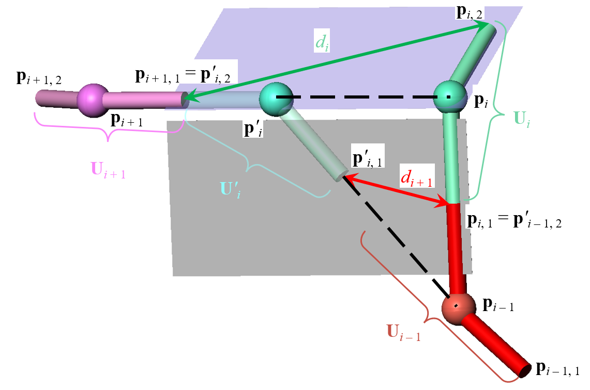
 
**图 7 前向步骤的一个环节**
</center>


## 4.1 基于SMU的FABRIK算法稳定性证明


$\boldsymbol{{lemma 1}}$：**如下图所示,** $\boldsymbol{\overline{BC}>\overline{DE}}$。证明如下


&#160; &#160; &#160; &#160;如图所示的$\Delta ABC$，长度$\overline{BD}=\overline{CE}$。当$\Delta ABC$为等腰三角形时，毋庸置疑，$\overline{BC}>\overline{DE}$。

&#160; &#160; &#160; &#160; 当$\Delta ABC$不为等腰三角形时，需要作辅助线。在底边$\overline{BC}$上的两个内角较大的为$\alpha$，较小的为$\beta$。点$E$在内角$\alpha$一侧。过点$E$作辅助线平行于$\overline{AB}$，交$\overline{BC}$于点$F$，在线段$\overline{EF}$上取一点$G$，使得$\overline{EG}=\overline{BD}$。
<center>

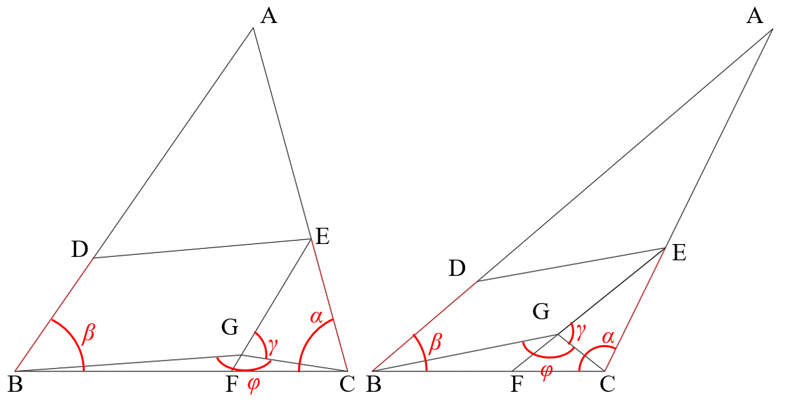

**图 8 $d_i>d_{i+1}$证明图例**
</center>


&#160; &#160; &#160; &#160; 证明过程如下，
<center>


$$\begin{align}
\notag&\because \overline{EG}=\overline{EC} \\
\notag&\therefore\gamma = \angle ECG=\frac{(\alpha+\beta)}{2},\gamma<\frac{\pi}{2}\\
\notag&\because\frac{\pi}{2}<\angle CGF=\pi-\gamma<\phi\\
\notag&\therefore在\Delta GBC中，\overline{BC}>\overline{BG}\\
\notag&\because\overline{BD}\mathop{//}\overline{EG},\overline{BD}=\overline{EG}\\
\notag&\therefore\overline{BG}=\overline{DE},\overline{BC}>\overline{DE}\\
\end{align}$$
</center>

&#160; &#160; &#160; &#160;如图所示为第$i$个运动单元的**调整**过程，调整前的误差为$d_i$，调整后的误差为$d_{i+1}$。为了证明收敛，则需要证明在**调整**过程中满足$d_i>d_{i+1}$。

&#160; &#160; &#160; &#160;当运动单元为**SMU**，如图6所示，此时，由三角形两边和大于第三边,同时考虑到$\overline{\mathbf{p}_i\mathbf{p}_{i,2}}=\overline{\mathbf{p}_{i+1,1}\mathbf{p}_{i}}$和$\overline{\mathbf{p}_i\mathbf{p}_{i,1}}=\overline{\mathbf{p}'_{i}\mathbf{p}'_{i,1}}$可知
$$\begin{aligned}
\overline{\mathbf{p}_i\mathbf{p}_{i,2}}+\overline{\mathbf{p}_{i,2}\mathbf{p}_{i+1,1}}&>\overline{\mathbf{p}_i\mathbf{p}_{i+1,1}}\\
d_i&>\overline{\mathbf{p}_i\mathbf{p}'_i}\\
\end{aligned}$$
而$\overline{\mathbf{p}_i\mathbf{p}'_i}>d_{i+1}$则有以下性质。


<center>
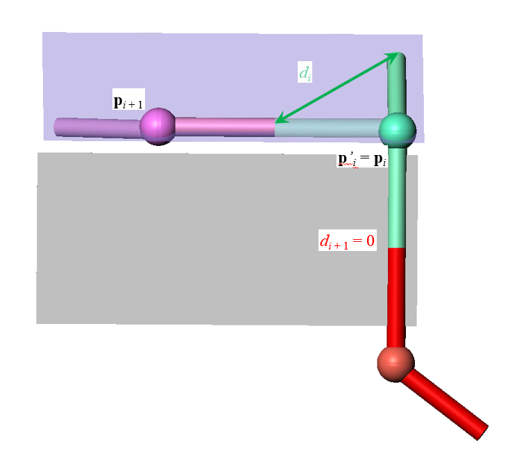
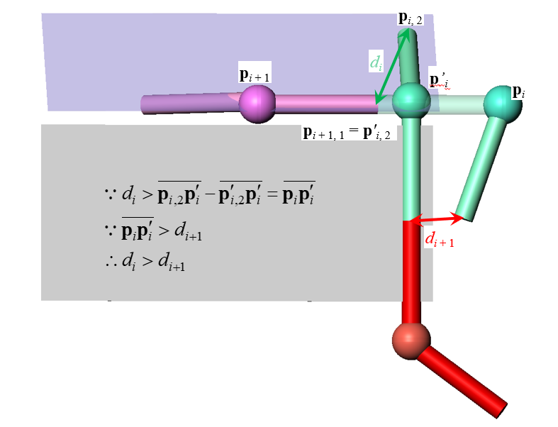
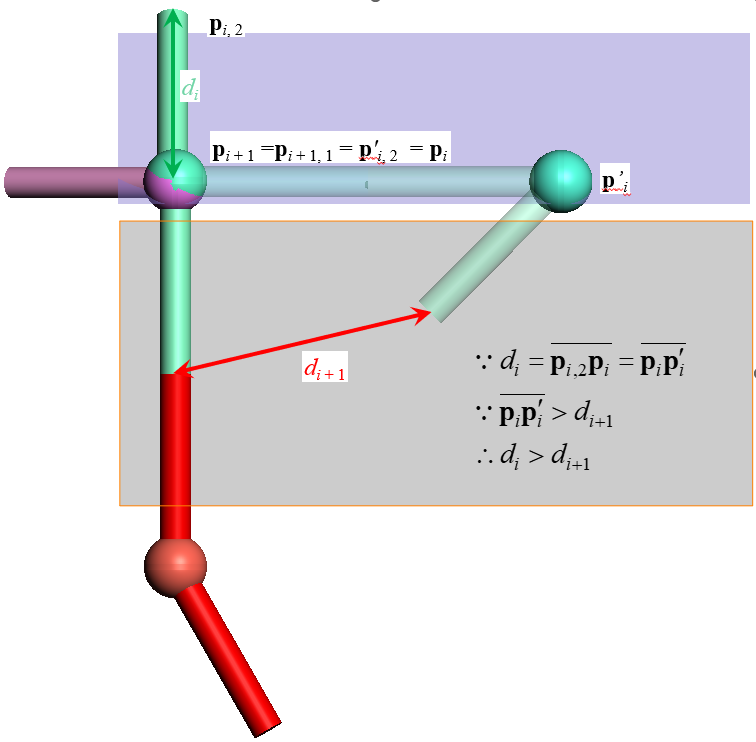

**图 9 $d_i>d_{i+1}$证明图例补充**
</center>

###4.1.2 纯粹极限解法
&#160; &#160; &#160; &#160; 考虑到$l_{i,1} + l_{i-1,2}=const_i$，其中$const_i$是第$i-1$连杆的杆长。因此设$l_{i,1} = 0, l_{i-1,2}=const_i$。因此，上述问题可以退化为如图所示的三种情况。


<center>
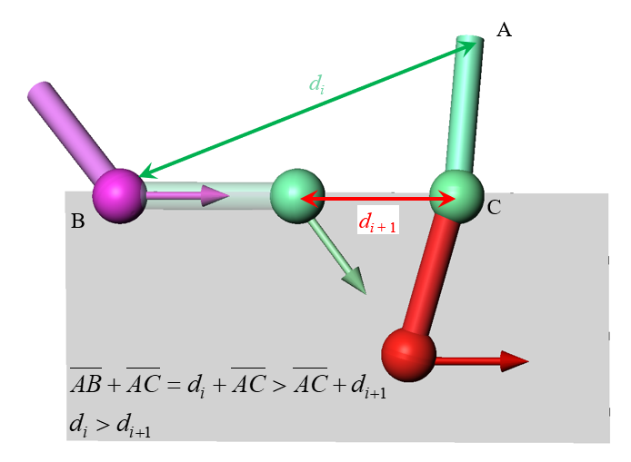

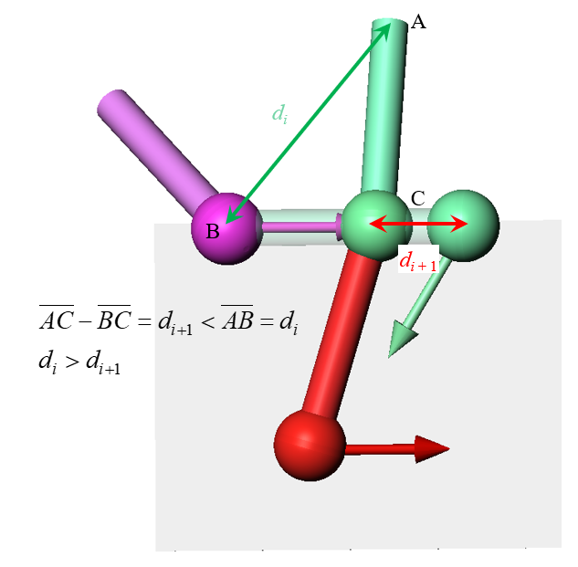
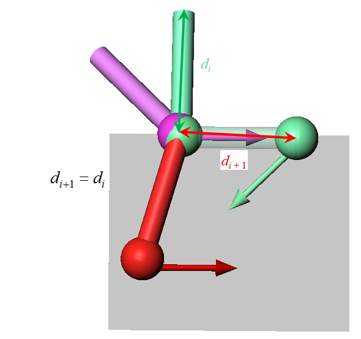

**图 10 $d_i>d_{i+1}$证明图例2**
</center>


###4.1.3 稳定性分析
<font color=red>
&#160; &#160; &#160; &#160; 因此，$d_i>d_{i+1}$。在<b>SMU</b>中，可知每一步<b>调整</b>的结果都比上一步的误差小。因此基于<b>SMU</b>的FABRIK是收敛的。


&#160; &#160; &#160; &#160; 收敛的最终结果是$\Delta \mathbf{p}_{i,2}\mathbf{p}_i\mathbf{p}_{i+1,1}$退化成一条线段，即点$\mathbf{p}_{i,2}$在线段$\overline{\mathbf{p}_i\mathbf{p}_{i+1,1}}$上。此时分为两种情况，若点$\mathbf{p}_{i,2}$在线段$\overline{\mathbf{p}_i\mathbf{p}_{i+1,1}}$某个端点上，此时收敛至$0$。若点$\mathbf{p}_{i,2}$在线段$\overline{\mathbf{p}_i\mathbf{p}_{i+1,1}}$中间，此时所有的运动单元中心共线，迭代过程中误差不变。这是一种误差为0的情况将在下一章进行讨论。
</font>

##4.2 基于RoMU的FABRIK算法稳定性证明

&#160; &#160; &#160; &#160; 相比于万向节运动单元，旋转 (roll) 运动单元与之类似，但是区别是旋转运动单元**RoMU**的 $\theta_i = \theta_0$，为一定值。以图7中的符号为例，在保证 $\overline{\mathbf{p'}_i\mathbf{p'}_{i,1}}$ 与 $\overline{\mathbf{p'}_i\mathbf{p'}_{i,2}}$ 夹角不变的情况下，使得 $\overline{\mathbf{p'}_i\mathbf{p'}_{i,1}}$ 与 $\overline{\mathbf{p}_i\mathbf{p}_{i,1}}$ 共面即可。此时有 $d_{i}>d_{i+1}$，当且仅当 $\mathbf{p}_{i,1}$ 与 $\mathbf{p}_{i,2}$ 重合时，取等号。

##4.3 基于RMU的FABRIK算法稳定性证明

&#160; &#160; &#160; &#160; 相比于万向节运动单元，旋转（pitch, yaw）运动单元与之类似，但是区别是旋转运动单元**RMU**的 $\delta_i\in\{-\delta_0,\delta_0\}$，只有两个值可以选择。因此需要将图7中的 $\mathbf{p}_{i-1}$ 投影至第 $i$ 个旋转运动单元所在平面为$\mathbf{\hat{p}}_{i-1}$。然后以 $\mathbf{\hat{p}}_{i-1}$ 代替 $\mathbf{p}_{i-1}$ 进行与万向节运动单元相似的步骤。

&#160; &#160; &#160; &#160; **值得注意的是，第 $i$ 个旋转运动单元所在平面获取的方法。**

##4.4 基于常曲率CMU的FABRIK算法稳定性证明
&#160; &#160; &#160; &#160; 相比于万向节运动单元，连续体运动单元更为复杂，因为其结构参数之间互相耦合。$l_{i,1}$和$l_{i,2}$与$\theta_i$相关，因此，其求解与证明相比于**SMU**更为复杂。当**SMU**链满足

$$\begin{align}
\notag &N \rarr +\infty \\
\notag &\sum{(l_{i,1} + l_{i,2})}=const\\
\notag &l_{i,1} = l_{i,2}=\frac{const}{2N}\\
\notag &\theta_i = \theta_{i+1}\\
\end{align}
$$

时， 此时**SMU**链整体可以看做常曲率连续体运动单元**CMU**。

&#160; &#160; &#160; &#160; **有一SMU链 **$\mathbf{\Omega} = \{\mathbf{U}_1, \mathbf{U}_2,..., \mathbf{U}_n\}$**，其中**$l_{i,1}=l_{i-1,1}=l_{i,2},\delta\in(-\pi,\pi]$**，需要注意的是**$\mathbf{\theta}_i\in[0,\theta_{const}/n]$。设有一$\mathbf{base}$（5自由度）和$\mathbf{target}$（5自由度），$\mathbf{base}$与$\mathbf{target}$共面且方向之间的夹角为$\theta_{const}$，$\mathbf{target}$与$\mathbf{base}$之间的距离大于$\mathbf{\Omega}$的总长且$\mathbf{base}$与$\mathbf{target}$方向上的延长线的交点与$\mathbf{base}$之间的距离为$l_0$，如下图所示
其中，

$$l_{0} = \frac{l_{i,1}}{\tan{\frac{\theta_{const}}{2n}}}\tan{\frac{\theta_{const}}{2}} $$

<center>

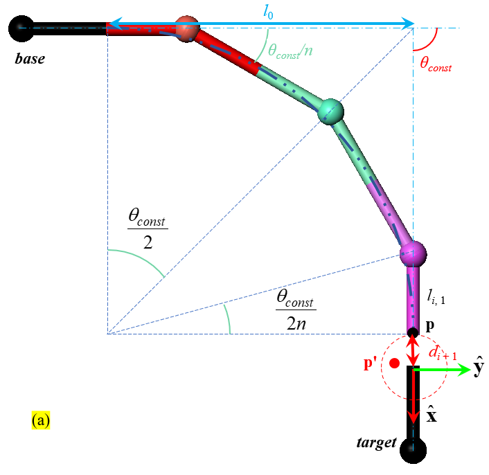
</center>

&#160; &#160; &#160; &#160; 此时如图建立二维坐标系，而$\mathbf{target}$与$\mathbf{base}$之间沿$\mathbf{\hat{x}}$的距离为$d_{x, bt}$，当该**SMU**链首端与 $\mathbf{base}$ 共线相连，该链末端到 $\mathbf{target}$ 的最小距离为$d_{i+1} = d_{bt} - \frac{l_{i,1}}{\tan{\frac{\theta_{const}}{2n}}}\tan{\frac{\theta_{const}}{2}} \cos\theta_{const} + l_0$。（由最大内接圆计算）

&#160; &#160; &#160; &#160; 利用**反证法**证明。

首先定义坐标系
+ $\{target\}\equiv\{\hat{\mathbf{x}}, \hat{\mathbf{y}}\}$; 原点固定在$\mathbf{target}$的末端上,其中$\hat{\mathbf{x}}$与$\mathbf{target}$的轴线重合。

1、假如该**SMU**链存在一个姿态使得与$\mathbf{target}$的距离小于$d_{i+1}$，末端位置$\mathbf{p'}$如图所示。在坐标系$\{target\}$中，$\mathbf{p'}_x>\mathbf{p}_x$。

2、由于尺寸约束和运动单元弯曲角度限制，该**SMU**链存在在 $\mathbf{\hat{x}}$ 方向上有一个极限位置。由于 $\mathbf{target}$ 与 $\mathbf{base}$ 的在 $\mathbf{\hat{x}}$ 方向上的距离大于该链的总长。因此设 $\mathbf{p'}_x$ 在该极限位置上。

&#160; &#160; &#160; &#160; 为了获取极限位置，让每个运动单元在 $\mathbf{\hat{x}}$ 方向上靠拢至极限。如下图所示，左一为第一个运动单元运动至极限，证明过程如左一图所示。
&#160; &#160; &#160; &#160; 中间图为中间的运动单元运动，右一为最后一个运动单元运动至极限。

<center>

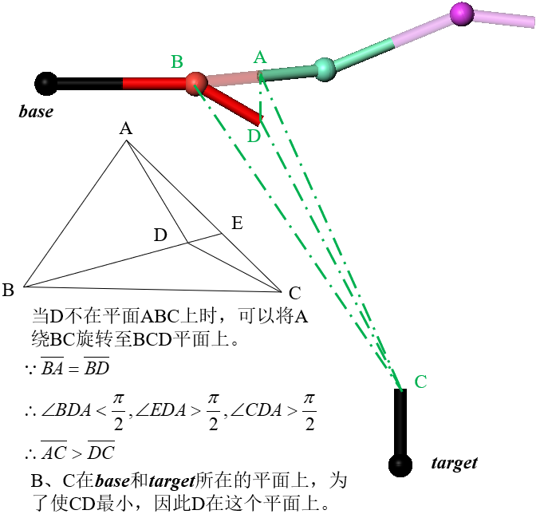
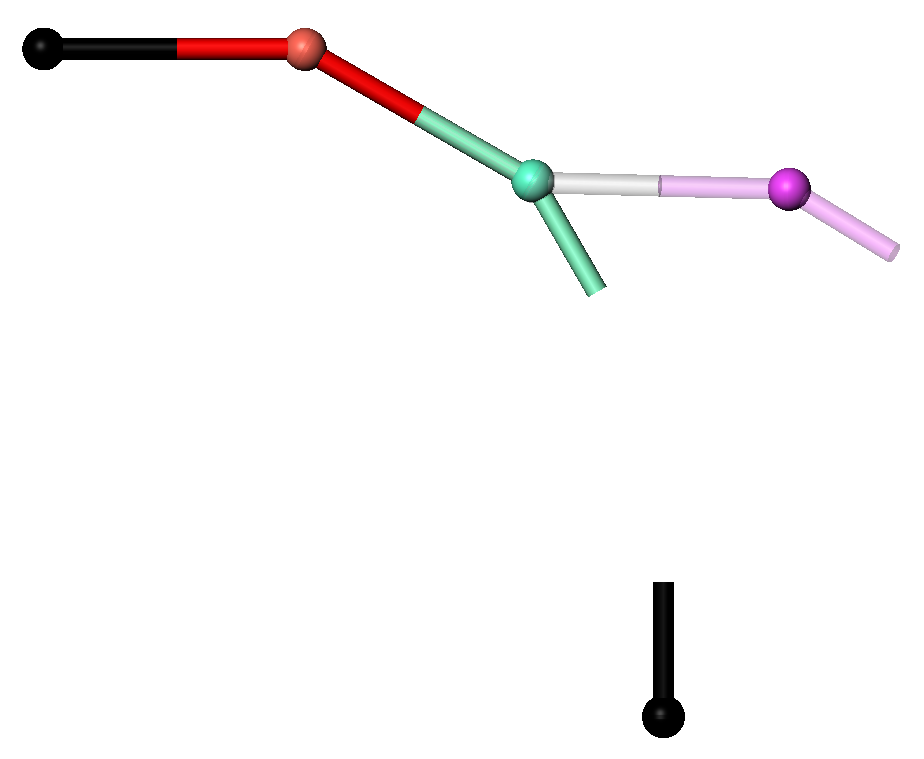
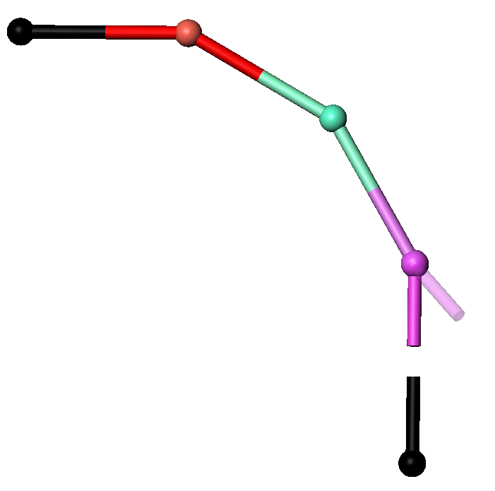
</center>

4、因此可以构建目标位姿如下，显然，所有的**SMU**在$\mathbf{target}$ 与 $\mathbf{base}$ 所构建的平面上。并且每个**SMU**都到达弯转极限。在 $\{target\}$ 坐标系下第 $i$ 个**SMU**末端的位置为

$$\mathbf{p'}_x=\mathbf{p}_{base}+\begin{pmatrix}
\hat{\mathbf{x}}\\
\hat{\mathbf{y}}\\
\end{pmatrix}=\mathbf{p}_{base}+\begin{pmatrix}
l_{1,1}\cos\theta_{const} + \sum_{k=1}^{i-1}{(l_{k,2}+l_{k+1,1})\cos(\theta_{const}-\frac{{k\theta_{const}}}{n})} + l_{i,2}\cos(\theta_{const}-\frac{{i\theta_{const}}}{n})\\
l_{1,1}\sin\theta_{const} + \sum_{k=1}^{i-1}{(l_{k,2}+l_{k+1,1})\sin(\theta_{const}-\frac{{k\theta_{const}}}{n})} + l_{i,2}\sin(\theta_{const}-\frac{{i\theta_{const}}}{n})\\
\end{pmatrix}$$
当$i=n$时，$\mathbf{p'}_x=\mathbf{p}_{base, x}+l_{1,1}\cos\theta_{const} + \sum_{i=1}^{n-1}{(l_{i,2}+l_{i+1,1})\cos(\theta_{const}-\frac{{i\theta_{const}}}{n}}) + l_{n,2}$，因为$\mathbf{p'}_x>\mathbf{p}_x$以及$l_{i,1}=l_{i-1,1}=l_{i,2}$，所以进一步地可以推出

$$\begin{align}
\notag l_{1,1}(-\cos\theta_{const}  - 1+ 2\sum_{i=0}^{N}{\cos(\theta_{const}-\frac{{i\theta_{const}}}{N}}))&>\frac{l_{1,1}}{\tan{\frac{\theta_{const}}{2n}}}\tan{\frac{\theta_{const}}{2}} (\cos\theta_{const} + 1)\\
\notag 2\sum_{i=0}^{N}{\cos(\theta_{const}-\frac{{i\theta_{const}}}{N}}) &> (1+\frac{\tan{\frac{\theta_{const}}{2}}}{\tan{\frac{\theta_{const}}{2N}}})(1+\cos\theta_{const})
\end{align}$$

5、上述结论与 $\boldsymbol{{lemma 2}}$ 冲突。因此不存在这样的姿态与$\mathbf{target}$的距离小于$d_{i+1}$，**原命题得证**，即该**SMU**链末端到 $\mathbf{target}$ 的最小距离为$d_{i+1}$。


$\boldsymbol{{lemma 2}}$**：**$2\sum_{i=0}^{N}{\cos(\theta_{const}-\frac{{i\theta_{const}}}{N}}) = (1+\frac{\tan{\frac{\theta_{const}}{2}}}{\tan{\frac{\theta_{const}}{2N}}})(1+\cos\theta_{const})$。证明如下


<center>


$$\begin{align}
\notag2\sum_{i=0}^{N}{\cos(\theta_{const}-\frac{{i\theta_{const}}}{N}}) &= 2\cos\theta_{const} + 2\sum_{i=1}^{N}{\cos(\theta_{const}-\frac{{i\theta_{const}}}{N}})\\
\notag&=2\cos\theta_{const} + 2\cos\theta_{const}\sum_{i=1}^{N}{\cos\frac{{i\theta_{const}}}{N}}+2\sin\theta_{const}\sum_{i=1}^{N}{\sin\frac{{i\theta_{const}}}{N}}\\
\end{align}$$
</center>

&#160; &#160; &#160; &#160; 其中，$\sum_{i=1}^{N}{\sin\frac{{i\theta_{const}}}{N}}$可以计算为

$$\begin{align}
\notag\sum_{i=1}^{N}{\sin\frac{{i\theta_{const}}}{N}} &=\frac{\sum_{i=1}^{N}{\sin\frac{{i\theta_{const}}}{N}\sin{\frac{\theta_{const}}{2N}}}}{\sin{\frac{\theta_{const}}{2N}}}\\
\notag&=\frac{\sum_{i=1}^{N}{\cos\frac{{(2i-1)\theta_{const}}}{2N} - \cos\frac{{(2i+1)\theta_{const}}}{2N}}}{2\sin{\frac{\theta_{const}}{2N}}}\\
\notag&=\frac{\cos\frac{\theta_{const}}{2N}-\cos\frac{3\theta_{const}}{2N}+\cos\frac{3\theta_{const}}{2N}-\cos\frac{5\theta_{const}}{2N}+...+\cos\frac{{(2N-1)\theta_{const}}}{2N} - \cos\frac{{(2N+1)\theta_{const}}}{2N}}{2\sin{\frac{\theta_{const}}{2N}}}\\
\notag&=\frac{\cos\frac{\theta_{const}}{2N}- \cos\frac{{(2N+1)\theta_{const}}}{2N}}{2\sin{\frac{\theta_{const}}{2N}}}\\
\notag&=\frac{\cos\frac{\theta_{const}}{2N} - \cos\theta_{const}\cos\frac{{\theta_{const}}}{2N} + \sin\theta_{const}\sin\frac{{\theta_{const}}}{2N}}{2\sin{\frac{\theta_{const}}{2N}}}\\
\notag&=\frac{1 - \cos\theta_{const} + \sin\theta_{const}\tan\frac{{\theta_{const}}}{2N}}{2\tan{\frac{\theta_{const}}{2N}}}\\
\end{align}$$
</center>

&#160; &#160; &#160; &#160; 同样的，$\sum_{i=1}^{N}{\cos\frac{{i\theta_{const}}}{N}}$可以计算为

$$\begin{align}
\notag\sum_{i=1}^{N}{\cos\frac{{i\theta_{const}}}{N}} &=\frac{\sum_{i=1}^{N}{\cos\frac{{i\theta_{const}}}{N}\sin{\frac{\theta_{const}}{2N}}}}{\sin{\frac{\theta_{const}}{2N}}}\\
\notag&=\frac{\sum_{i=1}^{N}{\sin\frac{{(2i+1)\theta_{const}}}{2N} - \sin\frac{{(2i-1)\theta_{const}}}{2N}}}{2\sin{\frac{\theta_{const}}{2N}}}\\
\notag&=\frac{\sin\frac{3\theta_{const}}{2N}-\sin\frac{\theta_{const}}{2N}+\sin\frac{5\theta_{const}}{2N}-\sin\frac{3\theta_{const}}{2N}+...+\sin\frac{{(2N+1)\theta_{const}}}{2N} - \sin\frac{{(2N-1)\theta_{const}}}{2N}}{2\sin{\frac{\theta_{const}}{2N}}}\\
\notag&=\frac{\sin\frac{{(2N+1)\theta_{const}}}{2N}-\sin\frac{\theta_{const}}{2N}}{2\sin{\frac{\theta_{const}}{2N}}}\\
\notag&=\frac{\sin\theta_{const}\cos\frac{{\theta_{const}}}{2N} + \cos\theta_{const}\sin\frac{{\theta_{const}}}{2N}-\sin\frac{\theta_{const}}{2N}}{2\sin{\frac{\theta_{const}}{2N}}}\\
\notag&=\frac{\sin\theta_{const} + \cos\theta_{const}\tan\frac{{\theta_{const}}}{2N}-\tan{\frac{\theta_{const}}{2N}}}{2\tan{\frac{\theta_{const}}{2N}}}\\
\end{align}$$
</center>

&#160; &#160; &#160; &#160; 回到起始
$$\begin{align}
\notag2\sum_{i=0}^{N}{\cos(\theta_{const}-\frac{{i\theta_{const}}}{N}}) &= 2\cos\theta_{const} + 2\cos\theta_{const}\sum_{i=1}^{N}{\cos\frac{{i\theta_{const}}}{N}}+2\sin\theta_{const}\sum_{i=1}^{N}{\sin\frac{{i\theta_{const}}}{N}}\\
\notag&=2\cos\theta_{const} + \frac{\sin\theta_{const} - \sin\theta_{const}\cos\theta_{const} + \sin^2\theta_{const}\tan\frac{{\theta_{const}}}{2N} + \sin\theta_{const}\cos\theta_{const} + \cos^2\theta_{const}\tan\frac{\theta_{const}}{2N}-\cos\theta_{const}\tan{\frac{\theta_{const}}{2N}}}{\tan{\frac{\theta_{const}}{2N}}}\\
\notag&=1+\cos\theta_{const} +\frac{\sin\theta_{const}}{\tan{\frac{\theta_{const}}{2N}}}\\
\notag&=1+\cos\theta_{const} +\frac{\frac{2\tan\frac{\theta_{const}}{2}}{1+\tan^2\frac{\theta_{const}}{2}}}{\tan{\frac{\theta_{const}}{2N}}}\\
\notag&=1+\cos\theta_{const} +\frac{(1+\cos\theta_{const})\tan\frac{\theta_{const}}{2}}{\tan{\frac{\theta_{const}}{2N}}}\\
\notag&=(1+\frac{\tan{\frac{\theta_{const}}{2}}}{\tan{\frac{\theta_{const}}{2N}}})(1+\cos\theta_{const})\\
\end{align}$$
</center>


当*N*趋近于无穷大，上述SMU链此时可以整体看做一个常曲率的**CMU**。

因此基于**CMU**的FABRIK算法的过程可以看做下图所示，
+ 将连续体看做一个无限数量**SMU**的运动链
+ 更新计算该链的每个关节的弯转极限，超出极限的需要按照新的极限更新位置，并与目标相连。（如下图（左）所示）
+ 如上述证明，更新该**SMU**链的姿态（如下图（中）所示）
+ 最终获得更新后的姿态（如下图（右）蓝绿色所示），更新前的姿态（如下图（右）红色所示）。


<center>
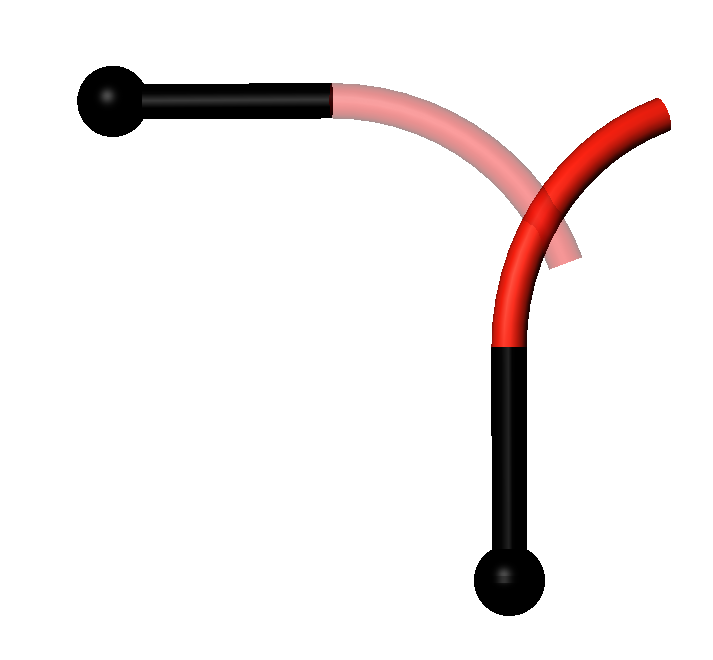
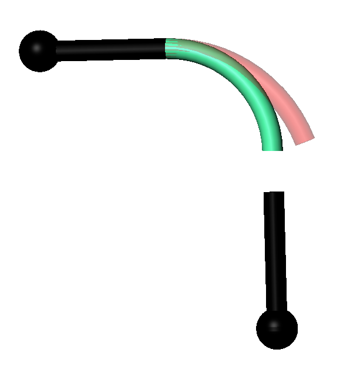
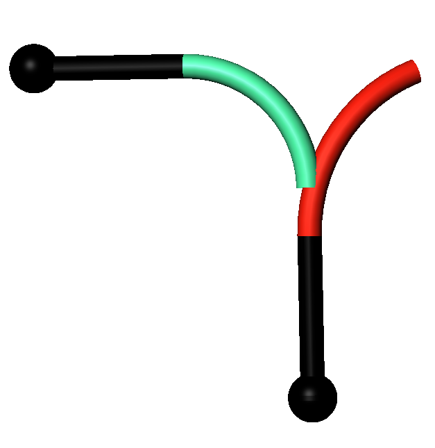


**图 11 $d_i>d_{i+1}$证明图例2**
</center>

##4.5 基于PMU的FABRIK算法稳定性证明

&#160; &#160; &#160; &#160; 移动运动单元的特点是 $\theta_i, \delta_i, l_{i,2}$ 不变，变化的是 $l_{i,1}$ 的值。
&#160; &#160; &#160; &#160; 类似于连续体运动单元，移动运动单元也需要先通过将运动单元连接上一个运动单元后，然后根据点到直线的最小距离确定移动运动单元的 $l_{i,1}$ 的长度变化。证明过程较为简单。

#5 不收敛至0的原因
&#160; &#160; &#160; &#160; 不收敛分为三种情况，
 + 位置姿态均可达
 + 位置可达，姿态不可达
 + 位置姿态均不可达
&#160; &#160; &#160; &#160; 此时分析第一种情况。当**所有的运动单元共线**且**目标值在该运动单元链的中间某个位置**时会出现有解但是FABRIK收敛但是不为0的情况，此时处于类似奇异的情况，FABRIK算法失去了往其他方向探索的可能。**解决方法是：选取初值时，各个运动单元不要全部共线**。

&#160; &#160; &#160; &#160; 需要注意的是，当目标在工作空间以外的时候，第二、三种情况的确会出现**收敛但是不为0**。


#收敛缓慢原因

&#160; &#160; &#160; &#160; 主要原因是误差处理是在一个局部范围内（一个运动单元链的某个运动单元上），因此导致了局部最速在全局上不是最速，甚至偏慢。

#多解

可以根据工作空间的交集来确定

#静力学分析，线性曲率
