手术过程中的操作力/力矩分析
===

v1
Keith W.
06.05.2022

---
[TOC]

---
## 综述
在手术过程中， 不同的操作任务需要不同的操作力，常见的手术任务有缝合、打结、切除、穿刺和触诊等。

在综述文章[1]中，介绍了不同手术过程中的平均操作力和最大操作力；在眼科（0.04 0.05）和血管（0.07 0.65）手术中，操作力不超过1N。在神经外科（0.68 1.48）和心胸（1.47 1.76）手术中不超过2N。
面向不同组织的操作力；神经（0.4 1.7）不超过2N。上皮组织（3.8 9.7）不超过10N。肌肉（4.1 6.7）不超过7N。
面向不同的任务；切除（2.28 4.48），钝性穿刺（1.21 3.58）

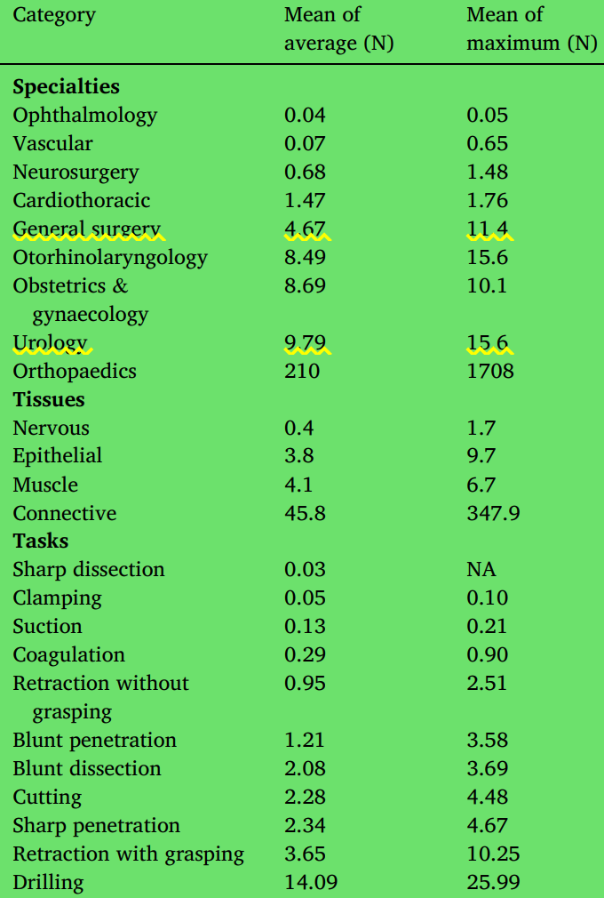

### 内容
首先分别从缝合、打结、切除、穿刺和触诊分别讨论现有的一些测量方法和测量结果。
其次分析交互力报告所需要的数据。
最后设计实验

---
## 操作任务
### 1 缝合

**缝合实验鼠**
文献[2],研究了一种用于机器人微创手术时力反馈的微型光学力传感器，

记录了使用不同针头缝合皮肤(S)、肌肉(M)和肝脏(L)组织时的峰值力。

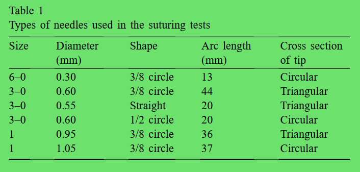  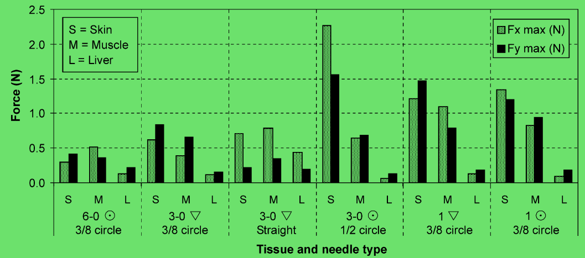

**缝合模型1**
文献[3]中介绍了缝合一个模型过程中的受力状态

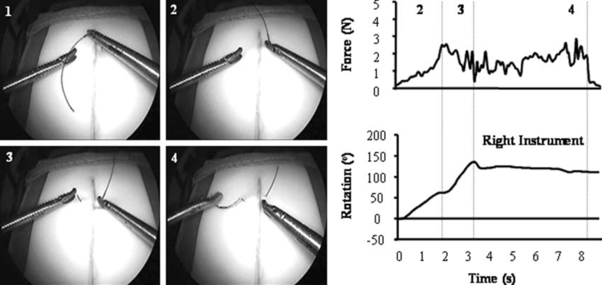

需要注意的是，通过经验不足的医生和经验丰富的医生之间的对比，**发现经验丰富医生的最大操作力比经验不足医生的操作力大**
十次对比中，均是如此。
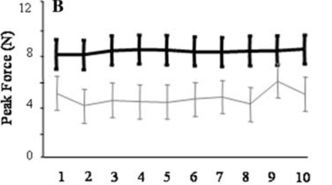

**缝合模型2**
在文献[4]中，如下图所示的实验设备，测得末端力大约为2.82N，Z方向力矩不超过20Nmm

### 2 打结

**纯粹无组织打结**
在文献[5]中，讲述了一种打结力的测试方法,右侧是一个弹簧测力计，通过15个经验丰富的医生依靠经验打结。然后记录打结力。

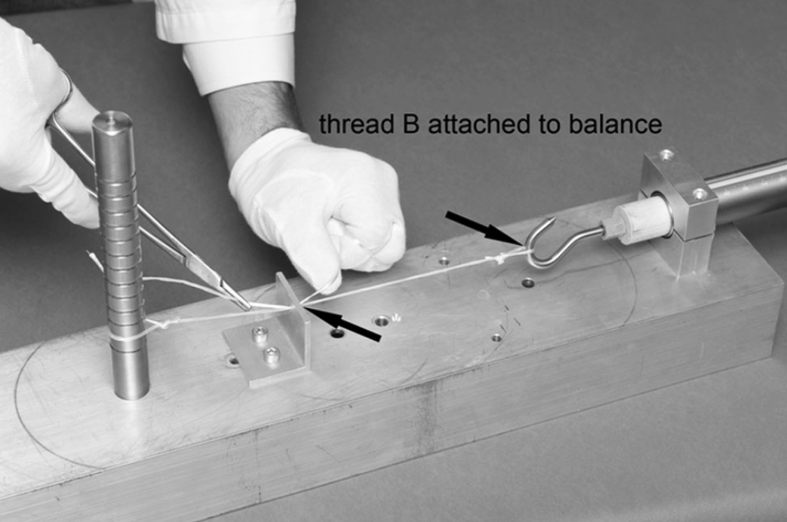

**模型打结1**
在文献[6]中，七名操作人员进行试验，每个人打五个结,
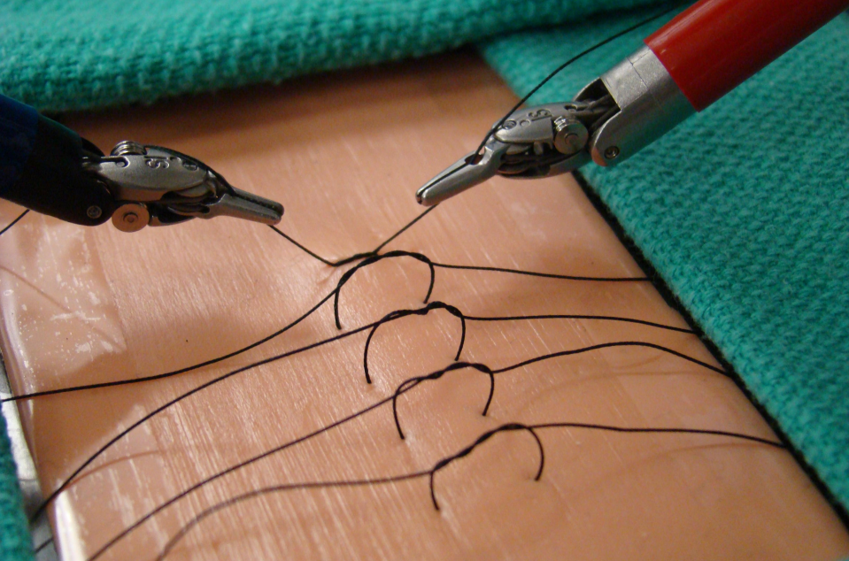 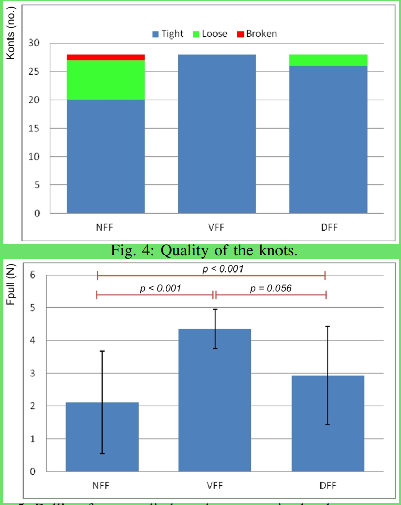

**模型打结2**
在文献[7]中，在猪皮实验中，认为3±0.5N是使用Prolene 4.0打结的最佳力，3次打结可以获得最大的打结安全性。缝线到伤口边缘的距离保持在10mm不变。采用1N、2N、3N、4N、5N五种打结力进行缝合。误差是±0.5N。
用Instron 3343 (Instron Corp., Canton MA, USA) 来测力。

结滑移和缝线断裂均被认为是试验的失效标准。
循环测试、静态测试、统计学测试

### 3 切除
**猪内脏切除**
在文献[8]中，讲述了一种新型传感器集成的手术工具。同时测量了在活体猪的切割猪肝的力。
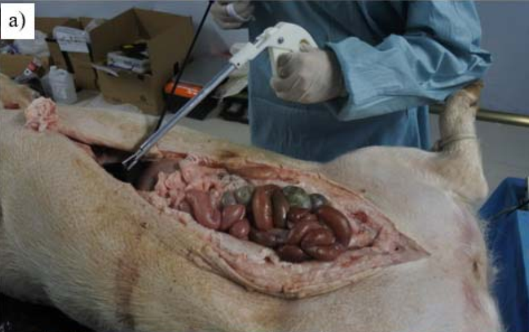 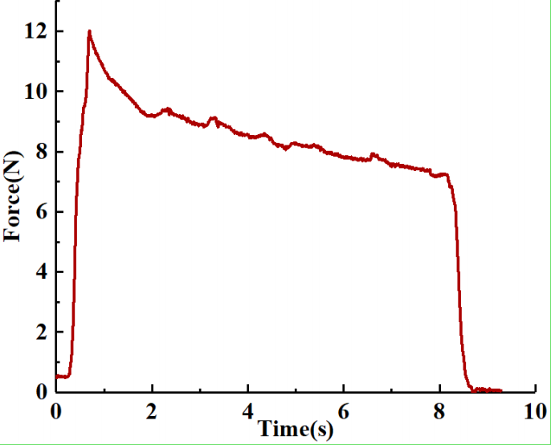

**神经手术（尸体）**
在文献[9]中，讲述了一种申请切除和凝结的测试结果
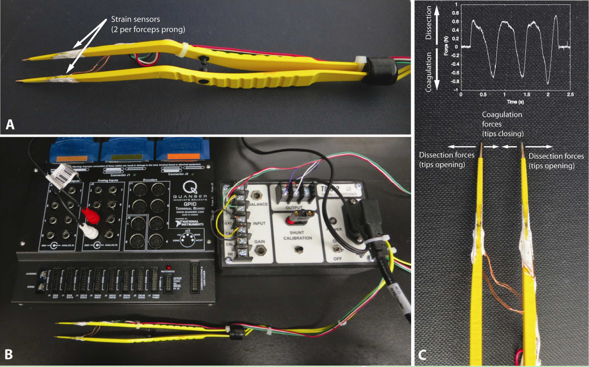 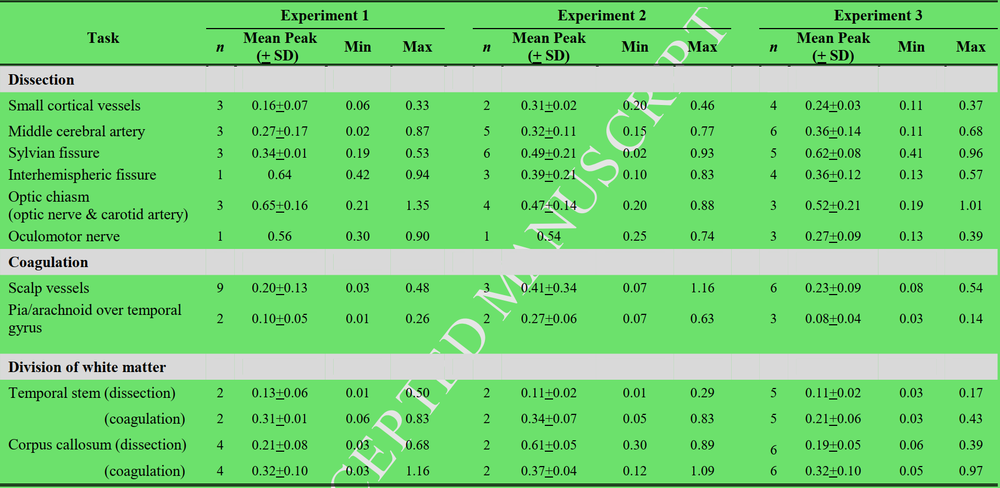

**猪脑神经**
在文献[10]中，讲述了猪脑切除实验

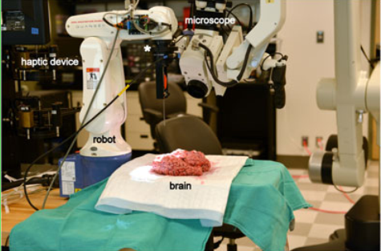 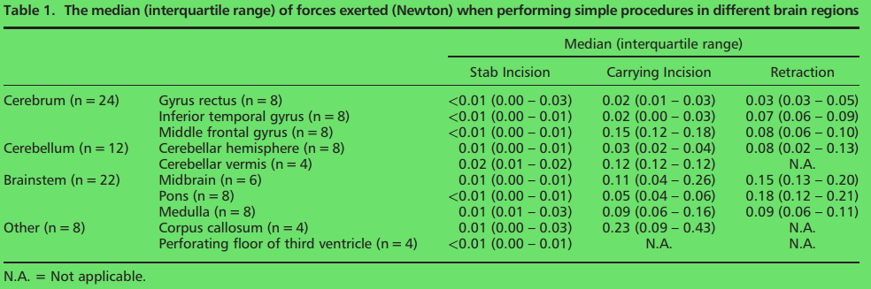

### 4 穿刺与触诊
在文献[11]中，通过使用相同的仪器探头进行**猪尸体**的组织穿刺力和结紧力的测试，同时使用拉力试验机测量缝线断裂力。通过在手柄和探针之间安装力传感器，测量末端力。
**触诊** **穿刺**

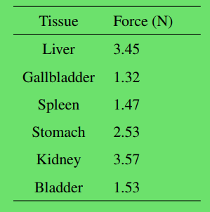  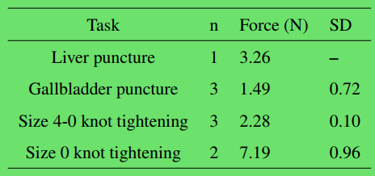

**猪胃按压与拉伸**
在文献[12]中，手术钳夹持猪胃时的**夹持力**进行测定，结果为14.2±0.05N。

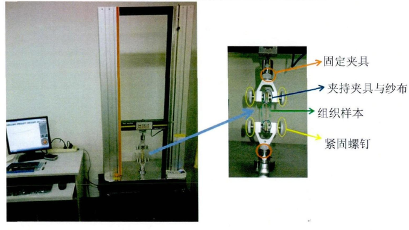

### 5 其他
在文献[13]中，讲述了一种新型集成力传感器的手术工具。
在文献[14]中，讲述了一种基于PVDF的力传感器手术夹钳。
在文献[15]中，讲述了一种结构类似于Stewart平台的可以集成在手术工具末端的力传感器。

## 交互力试验

### 1 

### 2

### 3

### 4

## 试验设定

## 

---
---
# 参考文献
[1]	A. K. Golahmadi, D. Z. Khan, G. P. Mylonas, and H. J. Marcus, "Tool-Tissue Forces in Surgery: A Systematic Review," Annals of Medicine and Surgery, vol. 65, May 2021.
[2]	J. Peirs et al., "A Micro Optical Force Sensor for Force Feedback During Minimally Invasive Robotic Surgery," Sensors and Actuators A: Physical, vol. 115, pp. 447-455, Spet. 2004.
[3]	A. Dubrowski, J. C. Larmer, J. K. Leming, R. Brydges, H. Carnahan, and J. Park, "Quantification of Motion Characteristics and Forces Applied to Tissues During Suturing," (in eng), American journal of surgery, vol. 190, no. 1, pp. 131-136, Oct. 2006.
[4]	R. C. Jackson and M. C. C. avus¸o˘glu, "Modeling of Needle-Tissue Interaction Forces During Surgical Suturing," in IEEE International Conference on Robotics and Automation, RiverCentre, Saint Paul, Minnesota, USA, 2012, pp. 4675-4680.
[5]	S. Neuhofer, K. Wieser, G. Lajtai, D. Mu¨ller, C. Gerber, and D. C. Meyer, "Surgical Knot Tightening: How Much Pull Is Necessary?," Knee Surgery, Sports Traumatology, Arthroscopy, vol. 22, no. 11, pp. 2849-2855, Nov. 2014.
[6]	A. Talasaz, A. L. Trejos, and R. V. Patel, "Effect of Force Feedback on Performance of Robotics-Assisted Suturing," in IEEE RAS/EMBS International Conference on Biomedical Robotics and Biomechatronics (BioRob), Rome, Italy, 2012, pp. 823-828.
[7]	S. W. Y. Lee, Y.-R. Wong, and S.-C. Tay, "Biomechanical Investigation of Different Tying Forces on Knot Security," Biomedical Journal of Scientific & Technical Research, vol. 17, pp. 1-6, Apr. 2019.
[8]	K. Sun, M. Li, S. Wang, G. Zhang, H. Liu, and C. Shi, "Development of a Fiber Bragg Grating-Enabled Clamping Force Sensor Integrated on a Grasper for Laparoscopic Surgery," IEEE Sensors Journal, vol. 21, no. 15, pp. 16681-16690, Aug. 2021.
[9]	L. S. Gan, K. Zareinia, S. Lama, Y. Maddahi, F. W. Yang, and G. R. Sutherland, "Quantification of Forces During a Neurosurgical Procedure: A Pilot Study," World Meurosurgery, vol. 84, Apr. 2015.
[10]	H. J. Marcus et al., "Forces Exerted During Microneurosurgery: A Cadaver Study," The International Journal of Medical Robotics and Computer Assisted Surgery, vol. 10, Jun. 2014.
[11]	D. R. Berg, T. P. Kinney, P. Y. Li, and A. G. Erdman, "Determination of Surgical Robot Tool Force Requirements through Tissue Manipulation and Suture Force Measurement," in Design of Medical Devices Conference, Minneapolis, MN, USA, 2011, pp. 1-4.
[12]	贾振岗, "手术钳夹持力测试系统与猪胃组织拉伸力学性能的研究," 硕士, 西南交通大学, 2015.
[13]	G. Tholey, A. Pillarisetti, W. Green, and J. P. Desai, "Design, Development, and Testing of an Automated Laparoscopic Grasper with 3-D Force Measurement Capability," in Lecture Notes in Computer Science, Cambridge,  MA,  USA, 2004, vol. 3078, pp. 38-48.
[14]	M. A. Qasaimeh, I. Stiharu, and J. Dargahi, "Modeling and Analysis of a Micromachined Tactile Sensor for Minimally Invasive Surgery," in Advances in Dynamics, Instrumentation and Control: World Scientific, 2007, pp. 315-324.
[15]	R. Haslinger, P. Leyendecker, and U. Seibold, "A Fiberoptic Force-Torque-Sensor for Minimally Invasive Robotic Surgery," in IEEE International Conference on Robotics and Automation, Karlsruhe, Germany, 2013, pp. 4390-4395.